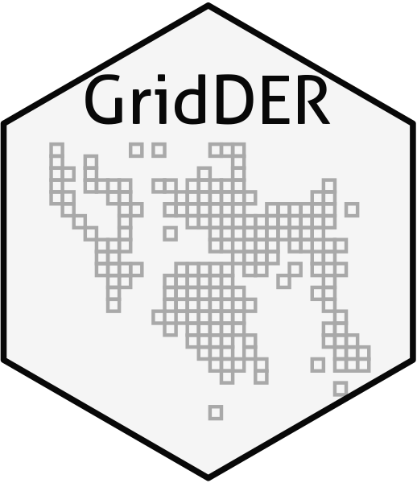

# occMagnet
The package find a grid system 


# Installing

Currently **modleR** can be installed from GitHub:

``` r

# Without vignette

if(!require(devtools)){
    install.packages("devtools")
}

if(!require(occMagnet)){
    devtools::install_github("Tai-Rocha/occMagnet")
}

```
