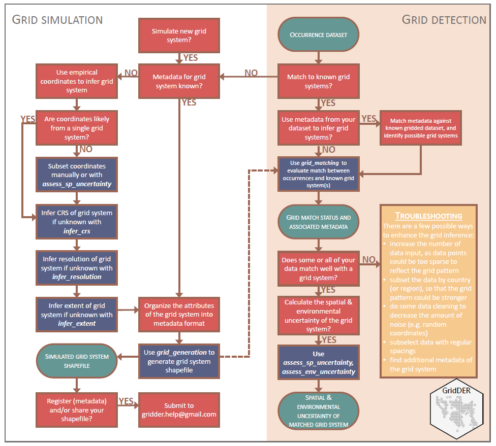

```{r setup, include=FALSE}
knitr::opts_chunk$set(echo = TRUE) # for development
```

```{r load, echo = FALSE, eval = TRUE, include=FALSE}
devtools::load_all() # for development
```


<br/><br/>

# Introduction

The package is a tool for identifying biodiversity records that have been designated locations on widely used grid systems. Our tool also estimates the degree of environmental heterogeneity associated with grid systems, allowing users to make informed decisions about how to use such occurrence data in global change studies. We show that a significant proportion (~13.5%; 261 million; accessed November 2021) of records on GBIF, largest aggregator of natural history collection data, are potentially gridded data, and demonstrate that our tool can reliably identify such records and quantify the associated uncertainties.

# Workflow for grid simulation and detection


```{r workflow image, echo=FALSE, out.width="80%"}

```

# Overview of functions in GridDER

```{r table_2, echo=FALSE}
#table_2 <- readr::read_csv("inst/table_2.csv") # Taina, table_2 is local file, not availaboe from Github.
table_2 <- gsheet::gsheet2tbl("https://docs.google.com/spreadsheets/d/1gj0EHmPpLNCNHZV09PQqt-ixG526Mvowjegk_z7oPyY/edit#gid=0")
knitr::kable(table_2)
```

# Install the GridDER package

```{r install package, echo= TRUE,warning=FALSE,eval=FALSE}
remotes::install_github("BiogeographyLab/gridder")

```

# Examples of grid systems   

Examples of four grid systems used in France (a), United Kingdom (b), South Africa
(c), and Australia (d). The four grid systems have different spatial solutions – 10km for (a), 1km
for (b), 5 arc-minute for (c), and 6 arc-minute for (d). The black points represent the biological
collections assigned to the centroid of the corresponding grid systems. All maps constructed
using WGS84.

```{r grid_systems, echo=FALSE, out.width="80%"}
knitr::include_graphics("inst/fig1.png")
```


# Major use cases

## Infer CRS (coordinate reference system) 

First load the demo occurrence data. This dataset includes a group of gridded coordinates. It was originally downloaded from GBIF [https://doi.org/10.15468/dl.fp5795; accessed on 29 November 2021], but has been simplified to be spatially unique points for easier demonstration.


```{r occs_unique,echo=TRUE,eval=TRUE}
data("occs_unique") # dataframe of occurrences
print( nrow(occs_unique)  )
print( head(occs_unique)  )
```

Look at the coordinates on a map

```{r plot map and occs, echo=TRUE, fig.width=6,fig.height=6}
library(ggplot2)
library(broom)

data("ne_10m_admin_0_countries") # load NaturalEarth world map

spdf_fortified = broom::tidy(ne_10m_admin_0_countries, region = "ADMIN")

ggplot2::ggplot() +
  geom_polygon(data = spdf_fortified, 
               aes( x = long, y = lat, group = group), 
               fill="#69b3a2", color="white") +
  geom_point(data = occs_unique,
             aes(x = decimalLongitude, y = decimalLatitude), 
             size = 2, 
        shape = 23, fill = "darkred") +
	coord_sf(xlim = c(0, 6), ylim = c(46, 50), expand = FALSE)

```
<br>
<br>

The coordinates have been projected to WGS84 (which is the same for occurrences from GBIF), which could be different from the CRS where the grid system was defined. So here we use infer_crs() to infer the correct CRS.

```{r infer_crs, eval=FALSE}
results_crs = gridder::infer_crs(occ_path = occs_unique, # input of coordinates
                                 truth_crs_num = "2154", # (optional) here we know the true CRS, just add it here for a comparison with the inferred CRS ,
                                 #flag_debug = c(4363,5451,5981,5982,5991,5992,5425,5424,5422,3901), # (optional) only evaluate a few CRS
                                 cup_num = 4) # the function will loop through many CRS, so using multiple cores can speed up the process. The default uses 2 cores, but you can adjust it to your preferred number. 

# You may want to save this output
saveRDS(results_crs,"vignettes/results_crs.rds")
```

It may take minutes - hours to complete the inference. If you want to quickly look at the output, you can load the results we calculated earlier.     
    
```{r load_results}
results_crs = system.file("extdata", "results_crs.rds", package = "gridder")
results_crs = readRDS(results_crs)
# Now, let's take a look at the output. The CRS code "2154" is ranked the first.
print(results_crs$selected[1:10, c("code", "note")])
```

## Infer the spatial resolution

```{r infer_resolution,echo=FALSE}
data("occs_unique") # Dataframe of occurrences

# Transform the coordinates to be spatial objects
input_occ = gridder::load_occ(occs_unique)
```

```{r infer_resolution2}
input_occ_prj = sp::spTransform(input_occ,crs(paste0("+init=epsg:","2154")))
result_res = gridder::infer_resolution(input_coord=input_occ_prj@coords,flag_unit="meter")
print(result_res$res_x)
print(result_res$res_y)

```
The inferred resolution is 10km on x & y axes     
     

## Infer the spatial extent

```{r infer_extent}
result_ext = gridder::infer_extent(method="crs_extent",
                          crs_grid=results_crs$selected$code[1],
                          flag_adjust_by_res=TRUE,
                          res_x=result_res$res_x,
                          res_y=result_res$res_y)

print(result_ext)
```


## Generation of a grid system based on its spatial attributes   

```{r grid_generation}

simulated_grid = gridder::grid_generation(res_x=result_res$res_x, # resolution along x-axis
                                          res_y=result_res$res_y, # resolution along y-axis
                                          unit="m",               # unit of resolution
                                          flag_crs=TRUE,          # user provides a CRS code
					  crs_num=results_crs$selected$code[1], # use the inferred CRS 
                                          country="France",       # the spatial file will be masked by country
					  flag_maskByCountry=TRUE,
                                          extent_unit="empirical_occ_extent",
                                          input_extent=result_ext,# use the inferred spatial extent
                                          flag_offset=c(0,-result_res$res_y*10,
                                                        result_res$res_x*10,0) # adjustment of the spatial extent                                          
                                          )
plot(simulated_grid)
																																																								

```

Check the simulated grid

```{r check simulated grid}
plot(simulated_grid,
     #ext=extent(c(extent(input_occ_prj)[1],extent(input_occ_prj)[1]+100000,
     #           extent(input_occ_prj)[3],extent(input_occ_prj)[3]+100000)))
      xlim=c(extent(input_occ_prj)[1],extent(input_occ_prj)[1]+110000),
      ylim=c(extent(input_occ_prj)[3],extent(input_occ_prj)[3]+110000))
plot(input_occ_prj,add=T,col="red")
```

## Match occ data set against known grid systems

```{r grid_matching}
# take 100 gridded points, and generate 100 random points
point_grid = input_occ[sample(1:length(input_occ),100),]
point_nongrid = point_grid
point_nongrid@coords=point_nongrid@coords+runif(100)
point_all=rbind(point_grid,point_nongrid)

plot(input_occ)
plot(point_grid,add=T, col="red")      # red is gridded coordinate 
plot(point_nongrid,add=T,col="orange") # orange is random (nongridded) coordinate
```

### Grid metadata   

We have compiled metadata for 34 grid systems, you could take a look at the table below.

```{r metadata}
meta_data <- gsheet::gsheet2tbl("https://docs.google.com/spreadsheets/d/1Qp5KOpLSVnF2t16uIbNwKwK5ZBXt4k5unONp7eopPzI/edit#gid=166945453") 

meta_data

```

Here, we simulated a grid based on the spatial attributes we just inferred.

```{r grid_matching2 }
grid_metadata = data.frame(grid_ID=c("88"),
                           resolution_x=c(10000),
                           resolution_y=c(10000),
                           resolution_unit=c("m"))

temp_result = gridder::grid_matching(input_occ=point_all,
                                     input_grid=simulated_grid,
                                     grid_metadata=grid_metadata,
                                     flag_relativeTHD=0.1,
                                     flag_absoluteTHD=10)

# 100 points were recognized to be gridded coordinates
print( table(temp_result@data$grid_closest_both))

plot(temp_result,col=as.factor(temp_result@data$grid_closest_both))
```

## Compute variation of environmental conditions

```{r Initilize, warning=FALSE, message=FALSE, results= "hide"}
rgee::ee_Initialize() # The follow command authorizes rgee to manage Earth Engine resources
```


```{r add image, echo=TRUE,fig.width=6,fig.height=6, eval=TRUE,  warning=FALSE}
# Load ImageCollection of interest (environmental layer)

nasadem = rgee::ee$Image('NASA/NASADEM_HGT/001')$select('elevation') # Global elevation data in 30 meters. We do not plot due to extension and resolution 

# Grid Id 9
data("grid_ID_9") # Grid system example available in the package 

grid = grid_ID_9 |> 
  rgee::sf_as_ee()

# Compute standard deviation

std_dev <- gridder::assess_env_uncertainty(x= nasadem, y= grid)

print(std_dev, n=5)

# Plot
library(ggplot2)
ggplot(data = grid_ID_9) +
  geom_sf(aes(fill = std_dev$elevation))+
  scale_fill_viridis_c(option = "plasma", trans = "sqrt")

```

Note the you need to setup rgee package (R package to acessess Google Earth Engine API) before using assessing the environmental variation (assess_env_uncertainty). You may need to use the following code to do so.

```{r setting intalations, echo=TRUE, eval=FALSE}

rgee::ee_install() # Creating virtual environmental to install the necessary dependencies

# If the following message happen : `An error occur when ee_install was creating the Python Environment. Run ee_clean_pyenv() and restart the R session, before trying again`

# Then execute the bellow command and restart R session:

rgee::ee_clean_pyenv()

# After that you must run `rgee::ee_install()`. You will request to continues and Rstart R seccion choose Yes in all options.

rgee::ee_Initialize() # The follow command authorizes rgee to manage Earth Engine resources

rgee::ee_check() # Checks if everything is OK. Optinal command . 

```


